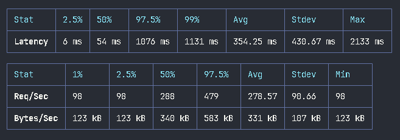
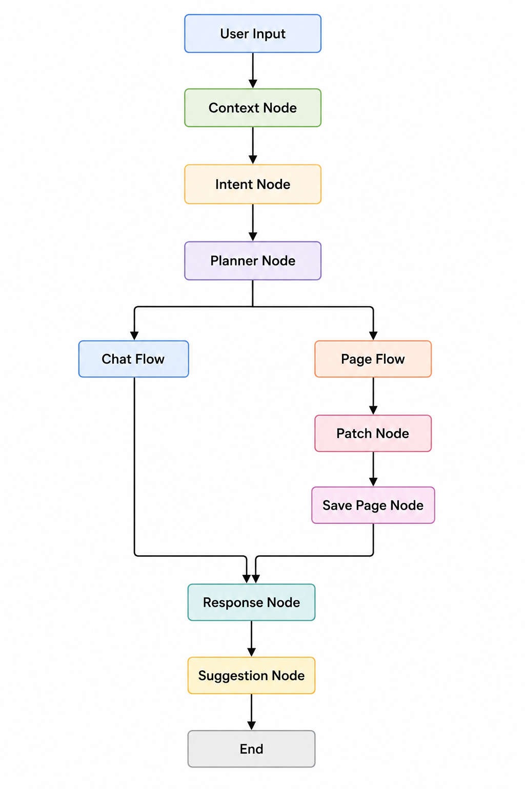

# 🧠 AI Notebook App

<p align="center">
  
  
  
  
  
  
  
</p>

> AI-powered notebook application with rich text editing, canvas drawing, authentication, LangGraph workflows, Docker deployment, and AWS hosting.

## 🌐 Live Demo

🔗 http://ec2-65-2-177-67.ap-south-1.compute.amazonaws.com/

## ✨ Features

- 🔐 JWT Authentication & OTP Verification
- 📝 Rich Text Editor & Notebook Management
- 🎨 Canvas Drawing
- 🤖 AI Assistant (LangChain + LangGraph)
- 🌙 Dark Mode
- ⚡ Zustand + React Query
- 📦 Redis Caching & Queues
- 🐳 Dockerized Deployment
- ☁️ AWS EC2 Hosting
- 🔄 GitHub Actions CI/CD

## 📊 Performance

- 👥 100 Concurrent Users
- ⚡ 278.57 Requests/sec
- 🕒 354ms Avg Latency
- 🎯 54ms P50
- 📉 1131ms P99
- ✅ 7362 Successful Requests
- 🛡️ 0 Server Errors

<p align="center">
  
</p>

## 🏗️ Tech Stack

**Frontend:** React, Vite, Tailwind CSS, Zustand, React Query, React Quill, React Sketch Canvas

**Backend:** Node.js, Express.js, TypeScript, MongoDB, Redis, BullMQ, JWT

**AI:** LangChain, LangGraph

**DevOps:** Docker, Nginx, AWS EC2, Docker Hub, GitHub Actions

## 🧠 AI Workflow

<p align="center">
  
</p>

## ⚙️ Environment

```env
PORT=8080
JWT_SECRET_KEY=your_secret
REDIS_HOST=redis
REDIS_PORT=6379
GROQ_API_KEY=your_key
BREVO_API_KEY=your_key
MONGODB_URI=your_uri
```

```env
VITE_BACKEND_URL=http://server:8080
```

## 🐳 Run with Docker

```bash
cd docker
docker compose up --build -d
```

## 📡 API Modules

- 🔐 Authentication
- 📂 Sections
- 📄 Pages
- 🎨 Canvas

## 🔄 CI/CD

```text
GitHub → Actions → Docker Build → Docker Hub → AWS EC2
```

## 🔐 Security

JWT • HTTP-Only Cookies • Password Hashing • Helmet • CORS

## 👨‍💻 Author

- 💻 GitHub: https://github.com/ramavathshivaram
- 📧 Email: ramavathshiva6300@gmail.com

## 📄 License

MIT License © 2026 Shiva Ram
